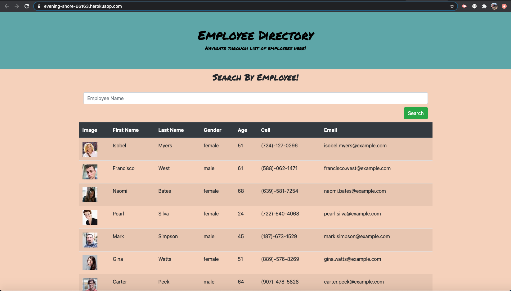

# Employee Directory Homework 19  

## Introduction  

This assignment was given to create a react website that can be used to sort through a list of employees by name. This was our introduction into react.js; so it is basic in its design.

## Table of Contents:  
* [Objectives](#Objectives)
* [Process](#Process)
* [Challenges](#Challenges)
* [Summary](#Summary)
* [Sites](#Sites)
* [Screenshots](#Screenshots)

## Objectives  

```md
The user will be able to view a list of employees and then be able to search by name.  

* As a user, I want to be able to view my entire employee directory at once so that I have quick access to their information.  

* As a user, I want to be able to view non-sensitive data about other employees. It would be particularly helpful to be able to filter employees by name.
```

## Process  

* I first copied the files into my own repository for the assignment.  
* I then built out a react component to run from.  
* I then copied mini-project as it had similar file structure to what we wanted.  
* I began altering components to display what I needed to display on the screen.  
* I updated an employee list using an api that generates random employees.  
* I then connected the app to Heroku for deployment.  

## Challenges  

This assignment was pretty tough for me. React has a different file structure than all the other structures we have worked with. It took much trial and error to get used to the state and components list. I had help from fellow students to get me through getting the list to propogate on the page. I struggled with deploying to github pages. I eventually went with Heroku as it worked better to render my page.  

## Summary  

This assignment was very challenging! I had to reframe my mind over and over to get used to the file structure and how things work, but it is slowly getting there. I need to keep practicing because I can see how useful it can be in the web development world. It has many uses and I am positive I can get the knowledge and comfortability very high!  

## Sites  

* [Link to repository on GitHub](https://github.com/j-midgley13/employee-directory-hw19)  

* [Link to deployed Heroku Website](https://evening-shore-66163.herokuapp.com/)  

## Screenshots  

  